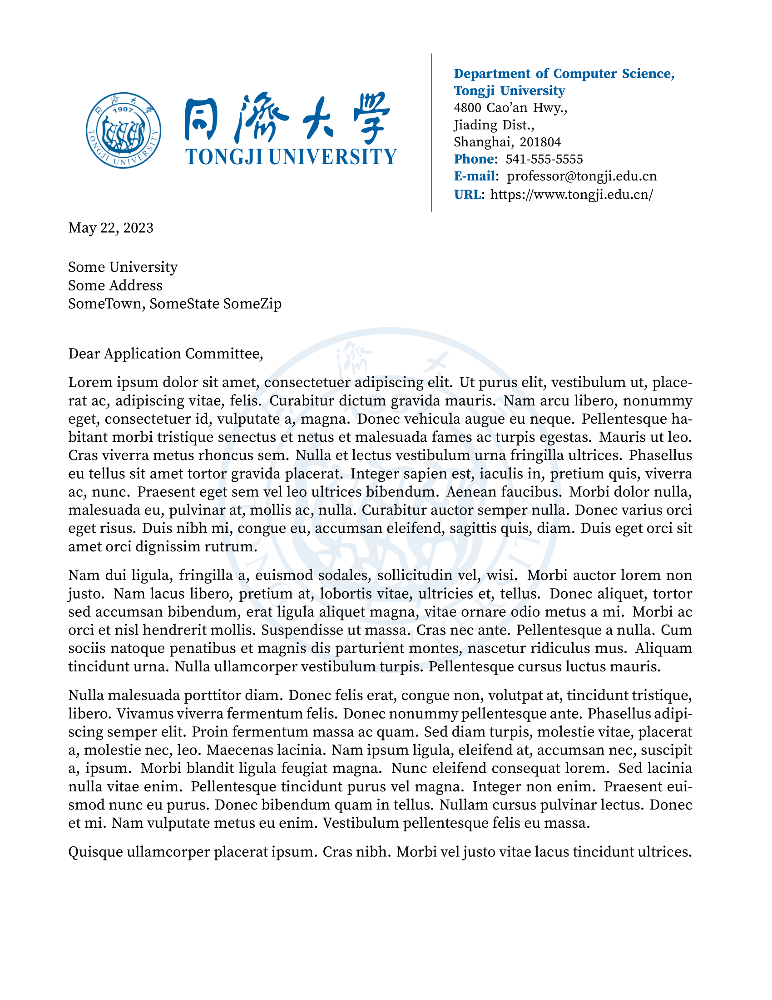

# 同济大学推荐信模板

:page_facing_up: 这是一个用于撰写同济大学推荐信的 LaTeX 模板。

## :one: 使用

### 1. Overleaf

#### 通过模板新建项目

您可以通过以下链接访问我们的 Overleaf 模板并使用：[](https://www.overleaf.com/latex/templates/tongji-recommendation-template/kdhmbtfyjfpr)

#### 自行导入 Overleaf

```shell
> git clone https://github.com/TJ-CSCCG/tongji-recommendation-template.git
```

之后登陆 Overleaf，新建项目后，将整个文件夹直接上传到项目中。

为确保编译通过，需将 Overleaf 的 Menu/Compiler 设置为 **LuaLaTeX**。

## :two: 贡献

当前模板在观感、实用性、编写体验等方面仍存在很大提升空间。

欢迎熟悉 `TeX` 基本指令和模板编辑的同学美化该模板。

## :three: 示例



## :four: 许可证

使用 **LPPL-1.3c** 许可证。

```
%% Copyright 2023 TJ-CSCCG
%
% This work may be distributed and/or modified under the
% conditions of the LaTeX Project Public License, either version 1.3
% of this license or (at your option) any later version.
% The latest version of this license is in
%   http://www.latex-project.org/lppl.txt
% and version 1.3 or later is part of all distributions of LaTeX
% version 2003/12/01 or later.
%
% This work has the LPPL maintenance status "maintained".
%
% This Current Maintainer of this work is R. Lin.
%
% This work consists of all the *.tex, *.cls and *.sty files in
%   https://github.com/TJ-CSCCG/tongji-recommendation-template
```
